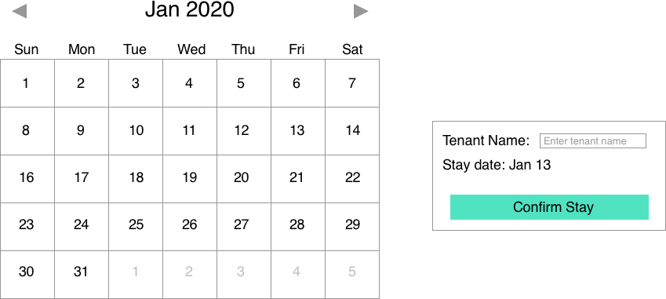
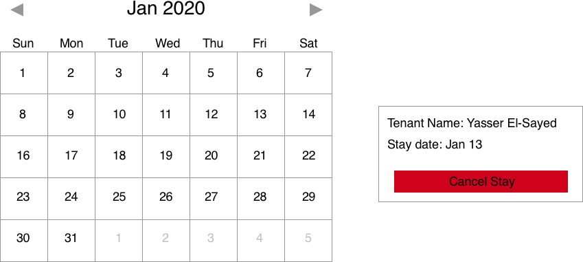

Calendar Reserver
=================

Description
-----------

For this assignment you have to implement a simple calendar that keeps track of reservations for a single room. The backend API you'll use is provided for you in this repository and will keep track of who has the room for which day. The application should have the three main functionalities: adding a tenant to a day, removing a tenant from a day, and moving between months to see all the dates.

The following is a mockup for confirming a stay on the calendar.
<br>
<br>


The following is a mockup for cancelling a stay on the calendar.
<br>
<br>


Getting Started
---------------

Install the package dependencies by running the following command:

```
npm install
```
Once the dependancies are installed, you can start the application server by running

```
npm start
```
Once the server is running, you can start making requests to http://localhost:3000.


Requests
--------
The following is an example of some of the requests that can be made to the backend. The data in the backend is stored simply day by day in the format:
```
{
    "tennantName": "John Carson",
    "time": 1578394800
}
```
Where the `time` is a unix timestamp.

To get the reserved dates you have to pass the start timestamp and end timestamp in the header like so:
```
> Request
GET localhost:3000/reserve/1577790000/1609153200   HTTP/1.1
Accept: application/json

> Response
[
    {
	"tennantName": "Carson Rhodes",
	"time": 1578394800
    },
    {
    	"tennantName": "Giovanni Ferrell",
    	"time": 1581591600
    },
    {
    	"tennantName": "Orlando Hawkins",
    	"time": 1582887600
    }
]
```

To reserve a single date you need to pass in a date and a name and `reserve` with `true` (if you want to unreserve that you have to pass it in with `false`):
```
> Request
POST localhost:3000/reserve   HTTP/1.1
Accept: application/json

{
	"tennantName": "Jimmy Carter",
	"time": 1578394800,
	"reserve": true
},

> Response
{
	"success": true
}
```

We've also added a helper request to get the current server time:

```
> Request
GET localhost:3000/now   HTTP/1.1
Accept: application/json

> Response
{
	"time": 1572117875
}
```

Feel free to edit the backend code at any time! Just make sure to mention it in your README.


Constraints & Requirements
--------------------------
You have to use **AngularJS 1.x**. It could be in any version of Javascript (ES6+ or ES5 it doesn't matter). You are **not** allowed to use a library for the calendar system that you're going to implement, that has be implemented by you. You can use any other library to help you with the CSS and Javascript.

Your application has to have the following:
- A way to navigate between months.
- A way to add tennants to a day.
- A way to remove tennants from a day.
- A clear README on how to set up your submission.

You should be able to complete this task in 5-6 hours if you're familiar with AngularJS.

Evaluation
----------
In this assignment we would like to see the following:
- Proficiency with Javascript.
- That it works; if the submission doesn't have all of the above 4 then the candidate will not be considered.
- Ability to understand and use APIs.
- Ability to use Github.
- Clean and easily testable code.
- Easily scalable code design.
- Well-commented code.
- Code Cleanliness.
- Clean commit history that reveal the evolution of this application
- If the code is opened in different pages there is bound to be race conditions which will lead to some errors; your code should handle that gracefully.

Remember, you can contact me at yasser@meddy.com at any time for any reason. **You will not be penalized at all for asking questions.**

Keep in mind
------------
This is a relatively simple task if you are familiar with AngularJS. That's intentional. The point of this task isn't to do the bare minimum. What we look for in a candidate is one that is going to provide a well engineered solution.

Solutions that have extra things too are a plus. You can add a lot to this simple application like:
- Feature to select multiple dates in one go.
- Feature to show the names of the tennants on the days without clicking on the days on the calendar.
- Feature to show the list of tennants outside for readability.

Sky's the limit. The more you do the better we perceive your candidacy.

Also if you don't know AngularJS I will be keeping that in mind as I'm evaluating your submission.

Submission
----------
You should upload your code to a Github repository (private or public) and share it with me. Your repository should have a README.md that explains how to run the code and if you’ve done anything extra. If you fail to produce this repository within the time period mentioned in the email you received your application will be rejected.
